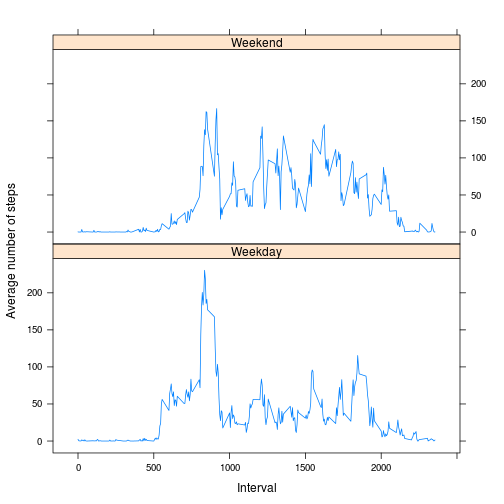

Reproducible Research: Peer Assessment 1
========================================================

## Loading and preprocessing the data


```r
data_read <- read.csv("activity.csv")
data_cleaned <- data_read[complete.cases(data_read), ]  ##remove NAs
```


## Loading required packages

```r
library(reshape2)
library(lattice)
```


## Setting locale to english on my nonenglish system on linux


```r
Sys.setlocale("LC_TIME", "en_GB.UTF-8")
```

```
## [1] "en_GB.UTF-8"
```


## What is mean total number of steps taken per day?

1. Make a histogram of the total number of steps taken each day


```r
## The cleaned data is first melted so that each row is a combination of date
## and steps. In a second step the data is casted and it creates the sum for
## each date. This is part of the reshape2 package. See for instance here
## http://www.seananderson.ca/2013/10/19/reshape.html

data_Melt <- melt(data_cleaned, id = c("date"), measure.vars = c("steps"))
steps_Data <- dcast(data_Melt, date ~ variable, sum)
```


## Create a histogram which shows the distribution of the total number of steps
## for each day:

```r
hist(steps_Data$steps, main = "Histogram of total number of steps each day", 
    xlab = "Total number of steps each day", ylab = "Number of days", breaks = 8)
```

 


2. Calculate and report the mean and median total number of steps taken per day

The mean is:

```
## [1] 10766
```


The median is:

```
## [1] 10765
```


## What is the average daily activity pattern?

1. Make a time series plot (i.e. type = "l") of the 5-minute interval (x-axis) and the average number of steps taken, averaged across all days (y-axis)


```r
## Once again the melt function creates a data frame with pairs of interval
## and Number of steps. Then the data frame is casted into the mean for each
## interval.

data_Melt_2 <- melt(data_cleaned, id = c("interval"), measure.vars = c("steps"))
steps_Mean <- dcast(data_Melt_2, interval ~ variable, mean)
```


## Plot the average number of steps per interval

```r
plot(steps_Mean, type = "l", xlab = "Interval", ylab = "Average number of steps")
```

 


2. Which 5-minute interval, on average across all the days in the dataset, contains the maximum number of steps?

It is interval number:

```
## [1] 835
```


## Imputing missing values

1. Calculate and report the total number of missing values in the dataset (i.e. the total number of rows with NAs)

The total number of missing values is:

```
## [1] 2304
```


2. Devise a strategy for filling in all of the missing values in the dataset. The strategy does not need to be sophisticated. For example, you could use the mean/median for that day, or the mean for that 5-minute interval, etc.

I will choose the mean for that 5-minute interval.

3. Create a new dataset that is equal to the original dataset but with
   the missing data filled in.


```r
data_Missing <- merge(data_read, steps_Mean, by = "interval", sort = FALSE)
colnames(data_Missing) <- c("interval", "steps", "date", "stepsMean")
data_Missing$stepsMean <- round(data_Missing$stepsMean)
data_Missing$steps[is.na(data_Missing$steps)] <- data_Missing$stepsMean[is.na(data_Missing$steps)]
data_Missing <- data_Missing[, c(2, 3, 1)]
```


4. Make a histogram of the total number of steps taken each day and Calculate and report the mean and median total number of steps taken per day. Do these values differ from the estimates from the first part of the assignment? What is the impact of imputing missing data on the estimates of the total daily number of steps?

Histogram:

```r
data_Missing_Melt <- melt(data_Missing, id = c("date"), measure.vars = c("steps"))
steps_Missing_Data <- dcast(data_Missing_Melt, date ~ variable, sum)
hist(steps_Missing_Data$steps, main = "Histogram of total number of steps each day", 
    xlab = "Total number of steps each day", ylab = "Number of days", breaks = 8)
```

 


The mean of the new dataset is:

```r
mean(steps_Missing_Data$steps)
```

```
## [1] 10766
```


Its median is:


```r
median(steps_Missing_Data$steps)
```

```
## [1] 10762
```


The difference in the mean and median are:

```r
mean(steps_Data$steps) - mean(steps_Missing_Data$steps)
```

```
## [1] 0.5493
```

```r
median(steps_Data$steps) - median(steps_Missing_Data$steps)
```

```
## [1] 3
```


As can be seen in the graphic below the new dataset has a similar distribution
of total number of steps taken each day. The histogram of the new dataset is 
lifted in the bar in the middle wheras the other bars stay on the same level.
This results in a slightly lower mean and a lower median. It can be stated that 
the impact of the missing data is rather low.


```r
par(mfrow = c(1, 2))

hist(steps_Data$steps, main = "(including NA)", xlab = "total number of steps taken each day")

hist(steps_Missing_Data$steps, main = "(NA replaced by mean)", xlab = "total number of steps taken each day")
```

 


## Are there differences in activity patterns between weekdays and weekends?

1. Create a new factor variable in the dataset with two levels – “weekday” and “weekend” indicating whether a given date is a weekday or weekend day.


```r
## The weekday function generates a new column whith weekdays of the date.  I
## found a guide to the solution in the forum:
## https://class.coursera.org/repdata-002/forum/thread?thread_id=56#post-233

data_Missing$weekday <- weekdays(as.Date(data_Missing$date))
weekend <- data_Missing$weekday == "Saturday" | data_Missing$weekday == "Sunday"
data_Missing$weekday[weekend] <- "Weekend"
data_Missing$weekday[!weekend] <- "Weekday"
data_Missing$weekday <- as.factor(data_Missing$weekday)
```


2.Make a panel plot containing a time series plot (i.e. type = "l") of the 5-minute interval (x-axis) and the average number of steps taken, averaged across all weekday days or weekend days (y-axis). The plot should look something like the following, which was creating using simulated data:


```r
## Once again the data is melted with two ids (interval and weekday).  It is
## then dcasted and the mean of each interval per weekday or weekend is
## calculated.

data_Missing_Melt <- melt(data_Missing, id = c("interval", "weekday"), measure.vars = c("steps"))
steps_Missing_Mean <- dcast(data_Missing_Melt, weekday + interval ~ variable, 
    mean)
xyplot(steps_Missing_Mean$steps ~ steps_Missing_Mean$interval | steps_Missing_Mean$weekday, 
    layout = c(1, 2), type = "l", xlab = "Interval", ylab = "Average number of steps")
```

 

